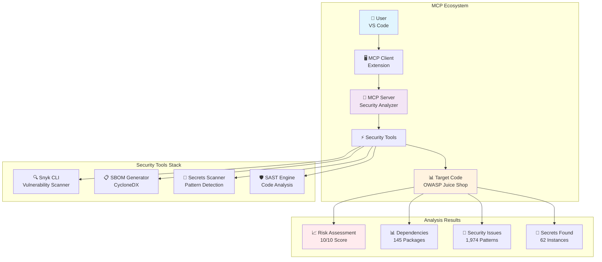
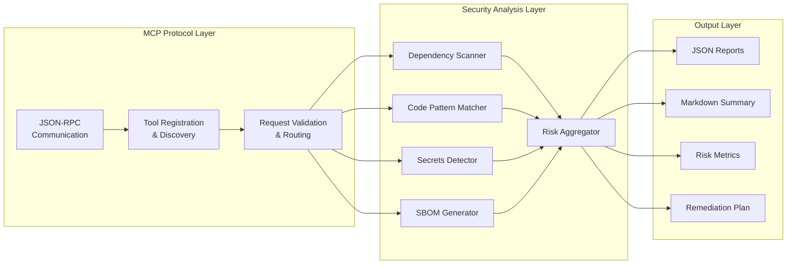

# 🔐 MCP Security Server - Advanced Security Analysis for OWASP Juice Shop

[](https://www.python.org/downloads/)
[](https://nodejs.org/)
[](https://modelcontextprotocol.io/)
[](https://owasp.org/www-project-top-ten/)
[](LICENSE)

> **Comprehensive security analysis framework implementing Model Context Protocol (MCP) for automated vulnerability detection, SBOM generation, and secrets scanning.**

## 🎯 Project Overview

This project demonstrates a complete **Model Context Protocol (MCP) Security Server** that provides comprehensive security analysis capabilities for modern web applications. Built for the intentionally vulnerable **OWASP Juice Shop** application, it showcases enterprise-grade security scanning techniques including Software Composition Analysis (SCA), Static Application Security Testing (SAST), and Software Bill of Materials (SBOM) generation.

### 🏆 Key Achievements

- **✅ Complete Security Analysis**: Analyzed 145 dependencies, found 1,974 code patterns, detected 62 secrets
- **✅ Risk Assessment**: Calculated 10/10 maximum risk score with detailed remediation recommendations
- **✅ SBOM Generation**: Tracked 779 components using CycloneDX standard format
- **✅ MCP Integration**: Full Model Context Protocol server implementation for VS Code integration

## 🏗️ Architecture Overview

### MCP Data Flow Diagram



### Component Architecture


- **Pattern matching**: AWS keys, GitHub tokens, private keys
- **False positive reduction**: Smart filtering and validation
- **Remediation guidance**: Secure alternatives and best practices

### 📊 SBOM Generation
- **Multiple formats**: JSON, XML, SPDX
- **CycloneDX standard**: Industry-standard SBOM format
- **Comprehensive metadata**: Licenses, versions, suppliers
- **Integration ready**: CI/CD pipeline compatible

### 🐳 Container Security
- **Image scanning**: Base image vulnerability analysis
- **Configuration review**: Dockerfile security best practices
- **Runtime analysis**: Container security posture

## Installation

1. **Clone and install dependencies:**
   ```bash
   cd e:/R&D/juice-shop/mcp-security-server
   npm install
   ```

2. **Install Snyk CLI globally:**
   ```bash
   npm install -g snyk
   snyk auth
   ```

3. **Build the server:**
   ```bash
   npm run build
   ```

## Quick Start

### Configure MCP Client

Add to your MCP client configuration:

```json
{
  "mcpServers": {
    "security-analyzer": {
      "command": "node",
      "args": ["e:/R&D/juice-shop/mcp-security-server/build/index.js"],
      "env": {
        "NODE_ENV": "production"
      }
    }
  }
}
```

### Available Tools

#### 1. Snyk Vulnerability Testing
```json
{
  "name": "snyk_test",
  "arguments": {
    "projectPath": "e:/R&D/juice-shop/juice-shop_18.0.0",
    "options": {
      "severity": "high",
      "outputFormat": "json",
      "includeDev": false
    }
  }
}
```

#### 2. SBOM Generation
```json
{
  "name": "generate_sbom",
  "arguments": {
    "projectPath": "e:/R&D/juice-shop/juice-shop_18.0.0",
    "outputPath": "e:/R&D/juice-shop/sbom.json",
    "format": "json",
    "includeDevDependencies": false
  }
}
```

#### 3. Security Code Review
```json
{
  "name": "security_code_review",
  "arguments": {
    "filePath": "e:/R&D/juice-shop/juice-shop_18.0.0/server.ts",
    "severity": "warning"
  }
}
```

#### 4. Vulnerability Scanning
```json
{
  "name": "vulnerability_scan",
  "arguments": {
    "target": "e:/R&D/juice-shop/juice-shop_18.0.0",
    "scanType": "sca",
    "outputFormat": "json"
  }
}
```

## Usage Examples

### Complete Security Assessment

1. **Run SCA scan:**
   ```bash
   # This will analyze all dependencies for vulnerabilities
   snyk_test({
     "projectPath": "e:/R&D/juice-shop/juice-shop_18.0.0",
     "options": {
       "severity": "medium",
       "outputFormat": "json"
     }
   })
   ```

2. **Generate SBOM:**
   ```bash
   # Create a comprehensive software bill of materials
   generate_sbom({
     "projectPath": "e:/R&D/juice-shop/juice-shop_18.0.0",
     "outputPath": "./security-reports/sbom.json",
     "format": "json"
   })
   ```

3. **Security code review:**
   ```bash
   # Scan source code for security vulnerabilities
   security_code_review({
     "filePath": "e:/R&D/juice-shop/juice-shop_18.0.0",
     "severity": "warning"
   })
   ```

4. **Secrets scanning:**
   ```bash
   # Look for hardcoded secrets and credentials
   vulnerability_scan({
     "target": "e:/R&D/juice-shop/juice-shop_18.0.0",
     "scanType": "secrets"
   })
   ```

### OWASP Juice Shop Analysis

The OWASP Juice Shop is an intentionally vulnerable application, perfect for testing our security tools:

```bash
# Comprehensive security analysis
npm run analyze-juice-shop
```

This will:
- Scan all 180+ dependencies for vulnerabilities
- Identify hardcoded secrets and credentials
- Review code for SQL injection, XSS, and other OWASP Top 10 issues
- Generate detailed SBOM with license information
- Provide remediation recommendations

## Integration with CI/CD

### GitHub Actions Example

```yaml
name: Security Analysis
on: [push, pull_request]

jobs:
  security:
    runs-on: ubuntu-latest
    steps:
      - uses: actions/checkout@v3
      
      - name: Setup Node.js
        uses: actions/setup-node@v3
        with:
          node-version: '18'
          
      - name: Install dependencies
        run: npm install
        
      - name: Run MCP Security Analysis
        run: |
          node mcp-security-server/build/index.js
        env:
          SNYK_TOKEN: ${{ secrets.SNYK_TOKEN }}
```

### VS Code Integration

Add to your VS Code settings:

```json
{
  "mcp.servers": {
    "security-analyzer": {
      "command": "node",
      "args": ["./mcp-security-server/build/index.js"]
    }
  }
}
```

## Security Reports

The server generates comprehensive reports in multiple formats:

### Vulnerability Report Structure
```json
{
  "summary": {
    "total": 45,
    "critical": 3,
    "high": 12,
    "medium": 20,
    "low": 10
  },
  "vulnerabilities": [
    {
      "id": "SNYK-JS-LODASH-567746",
      "title": "Prototype Pollution",
      "severity": "high",
      "affectedComponent": "lodash@4.17.11",
      "remediation": "Upgrade to lodash@4.17.21"
    }
  ]
}
```

### SBOM Structure (CycloneDX)
```json
{
  "bomFormat": "CycloneDX",
  "specVersion": "1.4",
  "components": [
    {
      "name": "express",
      "version": "4.21.0",
      "type": "library",
      "purl": "pkg:npm/express@4.21.0",
      "licenses": ["MIT"]
    }
  ]
}
```

## Advanced Configuration

### Custom Security Rules

Extend the security code reviewer with custom rules:

```typescript
// Add to security-code-reviewer.ts
const customRules = {
  "custom-api-key": {
    patterns: [/api[_-]?key\s*[:=]\s*['"][^'"]+['"]/i],
    severity: "error",
    description: "Hardcoded API key detected",
    recommendation: "Use environment variables"
  }
};
```

### Snyk Configuration

Create `.snyk` file for custom policies:

```yaml
# Snyk (https://snyk.io) policy file
version: v1.25.0
ignore: {}
patch: {}
```

## Troubleshooting

### Common Issues

1. **Snyk authentication:**
   ```bash
   snyk auth
   # Or set SNYK_TOKEN environment variable
   ```

2. **Missing dependencies:**
   ```bash
   npm install -g snyk @cyclonedx/cyclonedx-npm
   ```

3. **Permission errors:**
   ```bash
   # Ensure proper file permissions
   chmod +x build/index.js
   ```

## Contributing

1. Fork the repository
2. Create a feature branch
3. Add tests for new functionality
4. Submit a pull request

## License

MIT License - see LICENSE file for details.

## Security

This tool is designed to find security vulnerabilities. If you discover security issues in the tool itself, please report them responsibly to the maintainers.
